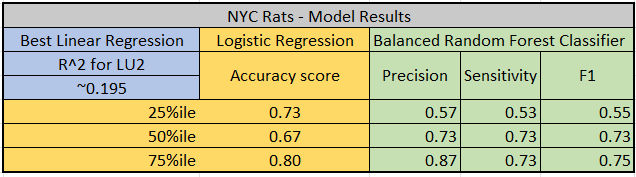

# Rats Sightings in NYC: Data Analysis 
Eliza Buffington, Luke Gates, Tom Leonard, and Ana Moreira

## GitHub Organization & Communication 
### GitHub Organization
**Main Branch** 

**Other Branches**
* Eliza Buffington 
* Luke Gates 
* Tom Leonard
* Ana Moreira 

### Communication Protocols 
The main line of communication is our #rats-of-nyc slack channel. We also have a folder on google drive that holds a google doc for our collective notes and a google slides for the draft presentation. 

## Overview of Project
### Purpose of Project
In a Gothamist news article, [Rodents on the rise: How NYC is losing the rat battle](https://gothamist.com/news/rodents-on-the-rise-how-nyc-is-losing-the-rat-battle?fbclid=IwAR0pbcNAk-yfgqFUHerhvtJKHcjrvVLESGORmzxSIhFQwtooGSHg9uG7dXU), Jake Offenhartz asserts that complaints of rat sightings in 2021 increased by more than two-thirds compared to the same period in 2019. Offenhartz suggests that a citywide temporary halt of pest control inspections at the start of the pandemic may be a significant factor of this increase in reported rat sightings more than two years after the start of the COVID-19 pandemic. 

The COVID-19 pandemic also coincided with a racial reckoning which left many wondering how the City would grapple with structural racism. As New York City tackles its rat problems, what role do the socioeconomic factors the of its residents play? The Gothamist article goes on to quote Sandy Nurse, the chair of the City Council’s Sanitation Committee, who called for “a more aggressive rat mitigation strategy, particularly in areas with high complaints, like public housing areas.” 

Is Nurse's claim that areas with high complaints are coming from areas like public housing or are wealthier zip codes more likely to file a complaint? To improve the city’s rat mitigation efforts in an equitable way, we must first understand the relationship between reported rat sightings and key indicators.

The purpose of this project is to evaluate various attributes throughout the 59 [community districts](https://www1.nyc.gov/assets/planning/download/pdf/about/publications/maps/nyc-community-districts-map.pdf) in New York City to identify key indicators leading to the largest reported rat sightings. These various attributes may include how much trash and/or the type of trash each community district produces, how the land area is used (commercial, residential, office, retail, etc.), weather factors such as amount of rainfall, or socioeconomic factors like income and educational attainment.  

Finally, we have chosen to organize the data based on community districts because if changes or preventative actions are made as a result of our work, it will likely occur at the local level. Our project allows residents to use their voting power to appeal to their local community leaders for impactful changes. Likewise, local community leaders can use our project to make informed, data-driven policies.   

For more information about this project, visit the [google slides](https://docs.google.com/presentation/d/1NuBLtA4dG-Bo6xwujSTi2HlrkTTZjnnAzIHUrRO8FwQ/edit?usp=sharing). 

### Questions Project Hopes to Answer 
* What types of neighborhoods report high levels of rat sightings? 
* What attributes do these neighborhoods share in common?
* What factors lead to high reported rat sightings? 
* How has the pandemic affected the reported rat sightings? 

 
### Data Sources
All data in the provisional model comes from NYC Open Data, a hub of analytics in New York City, is a partnership between the Mayor’s Office of Data Analytics and the Department of Information Technology and Telecommunications which contains information that is collected and maintained by the City government. 

#### [Rat Sightings](https://data.cityofnewyork.us/Social-Services/Rat-Sightings/3q43-55fe)
This database contains over 200,000 rows of data from all 311 Service Requests from 2010 to present and is automatically updated daily on NYC Open Data.

#### [Tonnage of Trash](https://data.cityofnewyork.us/City-Government/DSNY-Monthly-Tonnage-Data/ebb7-mvp5/data)
This database contains over 22,000 rows and provides monthly collection tonnages that the Department of Sanitation collects from NYC residences and institutions updated monthly on NYC Open Data. 

#### [Primary Land Use Tax Lot Output (PLUTO)](https://data.cityofnewyork.us/City-Government/Primary-Land-Use-Tax-Lot-Output-PLUTO-/64uk-42ks/data)
This database contains over 850,000 rows of extensive land use and geographic data at the tax lot level. The PLUTO files contain more than seventy fields derived from data maintained by city agencies.

---
## Database Integration
### SQL 

### Provisional Model 
The provisional database consists of **fifty-nine rows** representing the 59 community districts in New York City. Each community district has many different features that may or may not be contributing to the reported rat sightings. As we refine the model, we are trying to identify and integrate those features into our model. The provisional model has **two columns**, total_rats and tons_of_garbage, where total_rats represents the total number of rats per month in the respective community district and tons_of_garbage represents the total tons of garbage in per month in the respective community district. 

To create our provisional database, we merged the Rat Sightings and Tonnage of Trash datasets by community district using SQL. For both data sets, we summed the total rat sightings and tonnage of trash respectively for each community district. 

### Preliminary Model
The preliminary database consists of **fifty-nine rows** representing the 59 community districts in New York City and **twenty-one columns** representing:
* 1 column for the community discrict (primary key) 
* 1 column for total rat sightings 
* 1 column for label: "normal" or "outbreak" 
* 7 columns for the differeny types of trash - tons of trash  
* 11 columns for the different types of land use - % of community district 

To create our provisional database, we merged the Rat Sightings, Tonnage of Trash, and Primary Land Use Tax Lot Output (PLUTO) datasets by community district using SQL. First we expanded our provisional database by including all seven types of trash. Next, we created a column to categorize the total rat sightings as normal (2,500 rat sightings for fewer) or an outbreak (2,500+ rat sightings). Finally we summed each of the ll land use categories and divided them by the total land use area for each community district. 

---
## Machine Learning Model 
### Provisional Model  
Our provisional model is **supervised learning for regression**. Since our database deals with labeled data, we selected supervised learning. Our model is used to predict, based on data from community districts in NYC, the number of reported rat sightings. Because the final output will be a number, we chose regression over classification. We used scipy, matplotlib and pandas to calculate our results. 

Our provisional model is linear regression that inputs the total tons of garbage and outputs the total reported rat sightings for community districts.

The results are shown below after initializing and fitting with the code model = LinearRegression() and Using model.fit(X, y): 

With an intercept of 2,086 and a coefficient of .00056854. Our model represents the function f(x)=2086+.00056854x suggesting that every community district has an average of 2,086 rats sightings and every ton of garbage produces .00056854 of a rat sighting.

However, our model has an r-squared of 0.0283 meaning that only 2.8% of trash tonnage variance accurately indicated the number of rat sightings. Our chart also indicates that our variable is a poor predictor of rat sightings, as there were many districts that were outliers in terms of the amount of trash produced and the number of rat sightings. For example, some districts produced trash in the middle of the range of all districts but had rat sightings almost double that of comparable trash producers. Therefore, we will need to continue to refine the model. Our group has proposed looking at land use data and possibly socioeconomic factors that we can add and hopefully predict more accurate results.

### Preliminary Model 
After looking at initial land use data, our model still performed poorly. We assess other variables in a linear regression model, but still never saw an r-squared score near 0.7 (see table below). Based on these results we decided to implement a logistic regression model.

Our preliminary model is **supervised learning for logistic regression**. Since our database deals with labeled data, we selected supervised learning. In order to create a logistic regression model we needed to create a binary variable out of our rat data. Using results from the provisional linear regression model, we identified the 50th percentile of 2,517 or fewer rat sightings as "normal" and anything greater as an "exceedance".  We used sklearn, matplotlib, and pandas to calculate our results. 

First, we split the data into trainig and testing groups using the code:  X_train, X_test, y_train, y_test = train_test_split(X, y, random_state=1, stratify=y)

Next, we trained the model using the code: classifier = LogisticRegression(solver='lbfgs', random_state=1) and classifier.fit(X_train, y_train)

Our preliminary model has an accuracy score of 0.6666666. Thus, our model identified 66.6% of test groups accurately. While the accuracy score of .66 is below 0.7, it is a significant improvement from the provisional model. Therefore, our logistic regression model is more accurate than the linear regression model, but we will need to continue to refine the model. Our group has proposed using under and over sampling techniques as well as using our weak predicting variables together in a random forest model to increase the accuracy score. Additionally, we will use imbalanced classification reports that assesses the accuracy, precision, and sensitivity in order to select a final model. 

## Selection of Models and Final Model Results

As part of the process to develop a final product and selecting the best performing model a comparison of different Supervised Learning Models was performed using the 50 percentile division of our rata reports data.  The Models were then compared using the performance metrics provided by the KSlearn functions which are as follows;

Accuracy score - The percentage of correct predictions out of total predictions

Precision AKA positive predictive value PPV- Is the measure of how reliable a positive classification is. 

Precision = TP/(TP + FP)

In our context:
I know that the test for rat sightings says this district has more sightings than 50% of all other districts, how likely is it that this district actually has 50% more sightings than all other districts?

Sensitivity AKA Recall - Is the ability of the classifier to find all the positive samples.

Sensitivity TP/(TP + FN)

In our context:
"I know that this district has more rat sightings than 50% of all other districts, how likely is it that the test will say so?"

F1 Score AKA Harmonic Mean -  is a weighted average of the true positive rate (recall) and precision, where the best score is 1.0 and the worst is 0.0.

F1 = 2(Precision*Sensitivity)/(Precision + Sensitivity)

A useful way to think about the F1 score is that a pronounced imbalance between sensitivity and precision will yield a low F1 score.

A Table summarizing the different Model runs is show below;

As mentioned before a 70% benchmark was used to determine an acceptable performance and the table shows the models performed overall very closely but the Balanced Random Forest Classifier outperformed all other tested models.
2 top contestants were chosen to undergo some refinement; 
Logistic Regression Model - just seemed like a natural step up from the linear models and good contender for comparison
Balanced Random Forest Classifier- best predictive accuracy precision sensitivity specificity and f1 scores

The following steps was to look at how sensitive the models were to the classification division so we took a look at the other percentiles since our data didn't display a natural clustering pattern even when it was normalized so it would not be dependent on any other variable as shown in the next figure

and the Distribution curve was as follows;

where is can be seen the 25%ile for our data is 1,572 rat reports, the 50%ile is 2,517 and the 75%ile is 3,625 rat reports.

Once the Model runs were completed the following table was compiled for comparison

Once again the predictive model scores seem to indicate that the Balanced Random Forest Classifier (BRFC) outs performs the logistic model, with exception of the lower cut off value of 255ile where the logistic model accuracy actually was better at 73%.  The BRFC model however performed really well at the 75%ile level with Accuracy, precision, Sensitivity, Specificity, and F1 scores of 0.81, 0.87, 0.73, 0.90, and 0.75 respectively.  
The following images are snippets of the code used to generate these figures
first the models splits the data into a training and testing set.  

this particular run split the data into stratified sets of 75% training and 25% testing data points.

![code_balanced_accuracy]code_balanced_accuracy.png)

the accuracy code is 

and the commands to generate the other score numbers is as follows

confusion matrix

also summarized as follows

and imbalanced classification report

What this means is that the BRFC Model has an overall accuracy of 81%, it can also produce a reliable positive classification 87% of the time, and is able to find 0.73% of all the positive samples making it fairly sensitive.  Its specificity is 90% which means it can predict the lower numbers, below the 75%ile, very well although that is not as important for our analysis since we are more concerned with the extravagant higher numbers of rats.  This model runs also received a F1 score of 71% making it a fairly well balanced model.  

Comparatively and surprisingly the Logistic Model also had an overall accuracy of 80%, the biggest advantage the BRFC Model has over the Logistic Model is that it can rank the input variables (features) by order of importance so we can visualize and understand what influences the model the most.

For this analysis the features were very important in answering some of our original questions regarding socioeconomic characteristics of the different neighborhoods in New York City (Community Districts in our dataset)

once again the comparison of the different percentile model runs proved to be valuable see the following table summarizing the different scenarios feature ranking.

It can be seen that for all three scenarios the top ranking features are dominated by Residential Land Use and Organic and Paper Trash.  This type of neighborhood characteristics will later be better observed geo spatially in the Dashboard.
This model seems to be promising in the developments of a predictive tool of rat populations in urban cities such as NYC.  
It should noted however, that the 50%ile BRFC model could be considered more conservative by lowering the number of rats tolerance or target (depending on the model application) and it still attains same sensitivity even though the overall performance scored at 73%.

## Recommendations

- Continue Looking at other Socioeconomic Data such as Population Density and Household Income in order to find other influential factors
- Look for same data from different sources in order to further improve the calibration process
- Environmental factors such as climate data eg: temperature and rainfall
- Perform more in depth analysis of Time Series 
- Validate Models using same data from other US cities
--- 
## Dashboard 
We will use Tableau to create 
the final dashboard. This will contain interactive elements such as allowing users to filter by community districts or various time frames.

