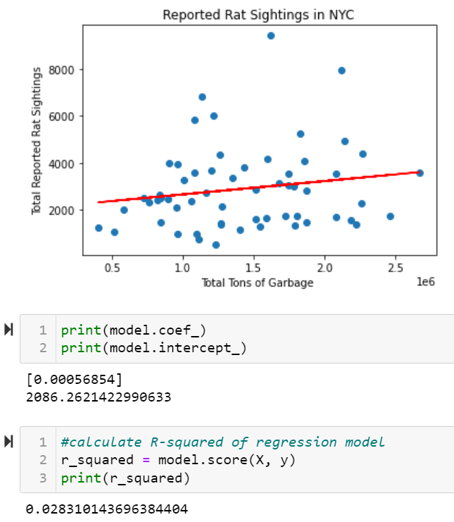

# Rats Sightings in NYC: Data Analysis 
Eliza Buffington, Luke Gates, Tom Leonard, and Ana Moreira

## GitHub Organization & Communication 
### GitHub Organization
**Main Branch** 

**Other Branches**
* Eliza Buffington 
* Luke Gates 
* Tom Leonard
* Ana Moreira 

### Communication Protocols 
The main line of communication is our #rats-of-nyc slack channel. We also have a folder on google drive that holds a google doc for our collective notes and a google slides for the draft presentation. 

## Overview of Project
### Purpose of Project
In a Gothamist news article, [Rodents on the rise: How NYC is losing the rat battle](https://gothamist.com/news/rodents-on-the-rise-how-nyc-is-losing-the-rat-battle?fbclid=IwAR0pbcNAk-yfgqFUHerhvtJKHcjrvVLESGORmzxSIhFQwtooGSHg9uG7dXU), Jake Offenhartz asserts that complaints of rat sightings in 2021 increased by more than two-thirds compared to the same period in 2019. Offenhartz suggests that a citywide temporary halt of pest control inspections at the start of the pandemic may be a significant factor of this increase in reported rat sightings more than two years after the start of the COVID-19 pandemic. 

The COVID-19 pandemic also coincided with a racial reckoning which left many wondering how the City would grapple with structural racism. As New York City tackles its rat problems, what role do the socioeconomic factors the of its residents play? The Gothamist article goes on to quote Sandy Nurse, the chair of the City Council’s Sanitation Committee, who called for “a more aggressive rat mitigation strategy, particularly in areas with high complaints, like public housing areas.” 

Is Nurse's claim that areas with high complaints are coming from areas like public housing or are wealthier zip codes more likely to file a complaint? To improve the city’s rat mitigation efforts in an equitable way, we must first understand the relationship between reported rat sightings and key indicators.

The purpose of this project is to evaluate various attributes throughout the 59 [community districts](https://www1.nyc.gov/assets/planning/download/pdf/about/publications/maps/nyc-community-districts-map.pdf) in New York City to identify key indicators leading to the largest reported rat sightings. These various attributes may include how much trash and/or the type of trash each community district produces, how the land area is used (commercial, residential, office, retail, etc.), weather factors such as amount of rainfall, or socioeconomic factors like income and educational attainment.  

Finally, we have chosen to organize the data based on community districts because if changes or preventative actions are made as a result of our work, it will likely occur at the local level. Our project allows residents to use their voting power to appeal to their local community leaders for impactful changes. Likewise, local community leaders can use our project to make informed, data-driven policies.   

### Questions Project Hopes to Answer 
* What types of neighborhoods report high levels of rat sightings? 
* What attributes do these neighborhoods share in common?
* What factors lead to high reported rat sightings? 
* How has the pandemic affected the reported rat sightings? 

 
### Data Sources
All data in the provisional model comes from NYC Open Data, a hub of analytics in New York City, is a partnership between the Mayor’s Office of Data Analytics and the Department of Information Technology and Telecommunications which contains information that is collected and maintained by the City government. 

#### [Rat Sightings](https://data.cityofnewyork.us/Social-Services/Rat-Sightings/3q43-55fe)
This database contains over 200,000 rows of data from all 311 Service Requests from 2010 to present and is automatically updated daily on NYC Open Data.

#### [Tonnage of Trash](https://data.cityofnewyork.us/City-Government/DSNY-Monthly-Tonnage-Data/ebb7-mvp5/data)
This database contains over 22,000 rows and provides monthly collection tonnages that the Department of Sanitation collects from NYC residences and institutions updated monthly on NYC Open Data. 

---
## Database Integration
The provisional data base consists of **fifty-nine rows** representing the 59 community districts in New York City. Each community district has many different features that may or may not be contributing to the reported rat sightings. As we refine the model, we are trying to identify and integrate those features into our model. The provisional model has **two columns**, total_rats and tons_of_garbage, where total_rats represents the total number of rats in (X time period) in the respective community district and tons_of_garbage represents the total tons of garbage in (X time period) in the respective community district. 

To create our provisional database, we had to concatenated the Rat Sightings and Tonnage of Trash datasets. For both data sets, we summed the total rat sightings and tonnage of trash respectively. Then we merged the data sets by community district.  

---
## Machine Learning Model 
Our model is **supervised learning for regression**. Since our database deals with labeled data, we selected supervised learning. Our model is used to predict, based on data from community districts in NYC, the number of reported rat sightings. Because the final output will be a number, we chose regression over classification.  

Our provisional model is linear regression that inputs the total tons of garbage and outputs the total reported rat sightings for community districts.

The results are shown below after initalizing and fitting with the code model = LinearRegression() and Using model.fit(X, y): 

With an intercept of 2,086 and a coefficient of .00056854. Our model represents the function f(x)=2086+.00056854x suggesting that every community disctrict has an average of 2,086 rats sightings and every ton of garbae produces .00056854 of a rat sighting.

However, our model has an r-squared of 0.0283 meaning that only 2.8% of trash tonnage variance accurately indicated the number of rat sightings. Our chart also indicates that our variable is a poor predictor of rat sightings, as there were many districts that were outliers in terms of the amount of trash produced and the number of rat sightings. For example, some districts produced trash in the middle of the range of all districts but had rat sightings almost double that of comparable trash producers. Therefore, we will need to continue to refine the model. Our group has proposed looking at land use data and possibly socioeconomic factors that we can add and hopefully predict more accurate results. 

